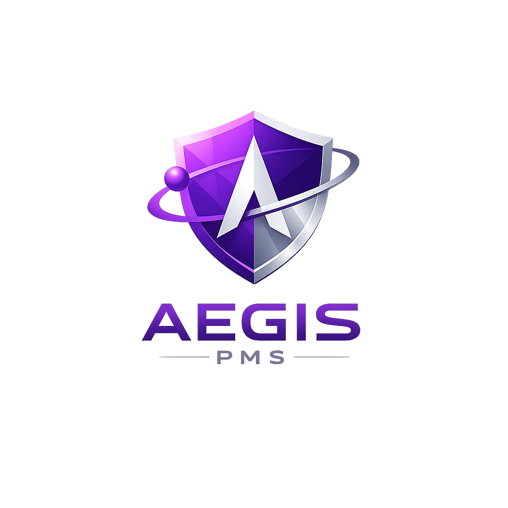
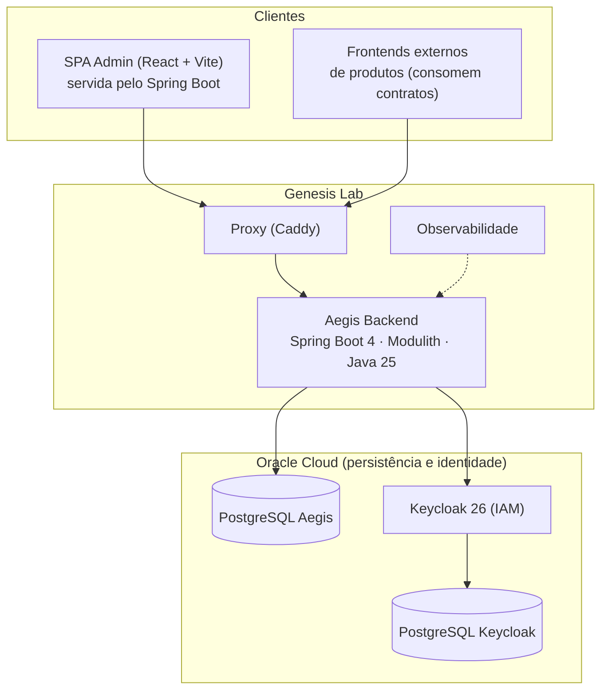
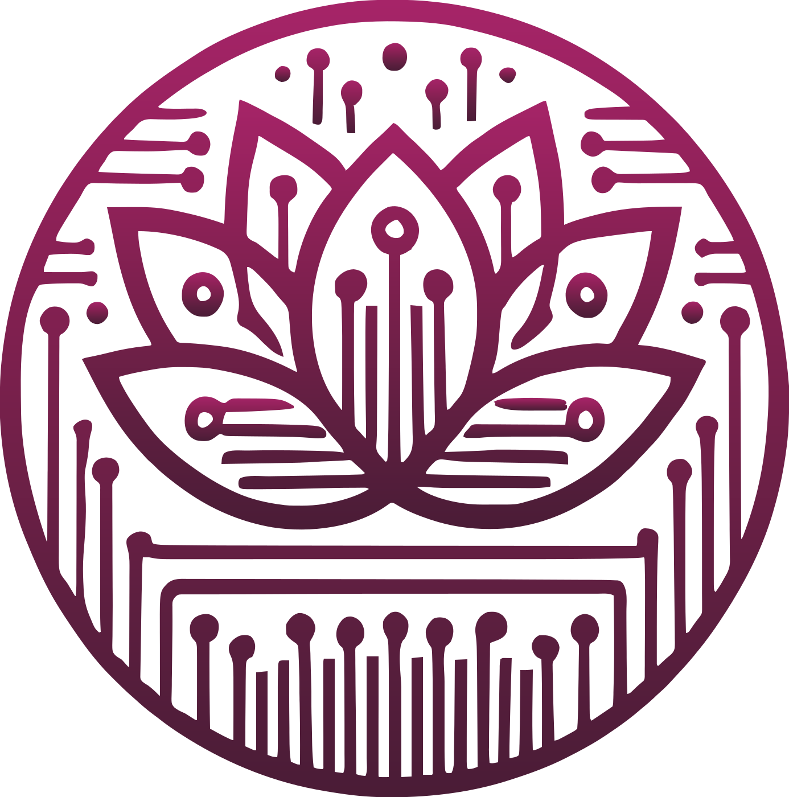

<div align="center">



# Aegis PMS

**Product Management System multi-tenant, modular e orientado a contratos**
*do ecossistema BYOP — Build Your Own Path*

[](https://github.com/alexandrehenrique-dev/aegis-pms/actions/workflows/ci.yml)
[](LICENSE)
[](https://www.conventionalcommits.org/pt-br/)
[](AGENTS.md)

<br/>

[](https://openjdk.org/)
[](https://spring.io/projects/spring-boot)
[](https://spring.io/projects/spring-modulith)
[](https://www.postgresql.org/)
[](https://www.keycloak.org/)
<br/>
[](https://react.dev/)
[](https://www.typescriptlang.org/)
[](https://vitejs.dev/)
[](https://tailwindcss.com/)
<br/>
[](https://www.docker.com/)
[](https://www.usebruno.com/)
[](.github/workflows/ci.yml)
[](https://flywaydb.org/)

</div>

---

## Sobre o projeto

O **Aegis** é a plataforma de gestão de produtos digitais do ecossistema **BYOP (Build Your Own Path)**. Ele não é um CMS comum: é um **PMS — Product Management System** — multi-tenant e multi-produto, onde cada produto digital vive com seus módulos, conteúdos, formulários, assets, usuários e permissões, tudo governado por contratos.

> O Aegis gerencia **produtos digitais**, não páginas. Ele **administra conteúdo**; **não renderiza páginas públicas**. Frontends externos consomem **contratos JSON canônicos**.

Pilares que definem a plataforma:

- **Product First** — o produto digital é a unidade central de tudo ([ADR-0001](docs/adr/ADR-0001-product-first.md));
- **Contract First** — a fronteira frontend/backend é definida por contratos JSON versionados ([ADR-0002](docs/adr/ADR-0002-contract-first.md), [ADR-0008](docs/adr/ADR-0008-json-contracts.md));
- **Multi-tenant por design** — shared database, shared schema, `tenantId` obrigatório em todas as tabelas de domínio ([ADR-0004](docs/adr/ADR-0004-shared-schema.md));
- **Identidade delegada** — autenticação e autorização via Keycloak, com papéis canônicos `AEGIS_*` ([ADR-0005](docs/adr/ADR-0005-keycloak.md), [ADR-0014](docs/adr/ADR-0014-modelo-canonico-de-papeis.md));
- **Monólito modular** — Spring Modulith com fronteiras de módulo verificadas, preparado para extração futura;
- **Knowledge Graph** — conteúdos relacionados formam um grafo de conhecimento por produto ([ADR-0016](docs/adr/ADR-0016-knowledge-graph-relacao-entre-conteudos.md)).

## Arquitetura



Em desenvolvimento, toda essa topologia sobe localmente com um único `docker compose up`. No CI, uma **stack efêmera e descartável** replica o ambiente do zero a cada execução ([ADR-0021](docs/adr/ADR-0021-stack-ci-efemera.md)).

| Ambiente | Compose | Característica |
|---|---|---|
| Desenvolvimento | [`docker-compose.yml`](docker-compose.yml) | stack completa local com volumes persistentes |
| CI | [`infra/docker-compose.ci.yml`](infra/docker-compose.ci.yml) | efêmera: tmpfs, realm importado e usuários criados automaticamente, `down -v` garantido |
| Produção | [`infra/docker-compose.prod.yml`](infra/docker-compose.prod.yml) | somente backend; PostgreSQL e Keycloak externos (Oracle Cloud) |

## Como executar (qualquer sistema operacional)

A única dependência obrigatória é o **Docker** (Docker Desktop no Windows/macOS, Docker Engine + Compose v2 no Linux). O mesmo fluxo funciona em qualquer SO:

```bash
# 1. Clone o repositório
git clone git@github.com:alexandrehenrique-dev/aegis-pms.git
cd aegis-pms

# 2. Crie o .env a partir do exemplo
cp .env.example .env          # Linux / macOS / Git Bash
# copy .env.example .env      # Windows (CMD)
# Copy-Item .env.example .env # Windows (PowerShell)

# 3. Suba a stack completa
docker compose up -d --build
```

Serviços disponíveis após a subida:

| Serviço | URL | Credenciais padrão |
|---|---|---|
| Backend (API + SPA) | http://localhost:8080 | — |
| Swagger / OpenAPI | http://localhost:8080/swagger-ui.html | — |
| Keycloak (Admin Console) | http://localhost:8282 | `admin` / `admin` |
| MailHog (captura de e-mails) | http://localhost:8025 | — |
| Frontend dev server (opcional) | http://localhost:5173 | — |

> **Primeira subida:** importe o realm `aegis` (`infra/keycloak/realm/aegis-realm.json`) e crie o usuário operacional — o passo a passo está em [`infra/keycloak/README.md`](infra/keycloak/README.md). No CI isso é 100% automático.

### Desenvolvimento fora do Docker

Requisitos: **Java 25 (Temurin)**, **Maven 3.9+** e **Node 22+**.

```bash
# Backend (http://localhost:8080)
cd backend && mvn spring-boot:run

# Frontend com hot reload (http://localhost:5173)
cd frontend && npm ci && npm run dev
```

No Windows os mesmos comandos funcionam em PowerShell, CMD ou WSL2. O build de produção do frontend é embutido no backend via [`scripts/build-frontend-for-backend.sh`](scripts/build-frontend-for-backend.sh) (SPA servida pelo Spring Boot — [ADR-0009](docs/adr/ADR-0009-spa-pages.md)).

## Padrões de qualidade

Qualidade aqui não é etapa — é portão. Nada chega à `develop` sem passar por todos os gates:

| Gate | Ferramenta | Critério |
|---|---|---|
| Typecheck frontend | `tsc -b --noEmit` | **zero erros e zero warnings** |
| Lint frontend | ESLint | **zero erros e zero warnings** — corrigir o código, nunca `eslint-disable` |
| Build & testes backend | `mvn clean verify` + JaCoCo | verde obrigatório, com cobertura |
| Testes de integração | Bruno CLI (31 coleções) | suíte completa contra a stack efêmera de CI |
| Higiene de infra | `docker compose down -v` | zero containers e zero volumes residuais, verificado a cada run |

```bash
# Rode localmente os mesmos gates do CI
cd frontend && npm run typecheck && npm run lint
cd backend  && mvn clean verify
cd bruno    && npx @usebruno/cli run --env local --sandbox developer
```

O fluxo de trabalho segue **Git Flow** (`feature/`, `bugfix/`, `hotfix/`, `chore/`, `docs/`, `sprint/` a partir da `develop`) com **Conventional Commits**. Commits diretos em `main`, `release` ou `develop` são proibidos. As regras completas — incluindo o protocolo para agentes de IA — estão em [`AGENTS.md`](AGENTS.md) e [`CONTRIBUTING.md`](CONTRIBUTING.md).

Pipeline (`.github/workflows/ci.yml`):

```
Frontend (typecheck + lint) ──┐
                              ├──▶ Docker Build ──▶ Stack CI efêmera ──▶ Bruno ──▶ down -v ──▶ Deploy (main)
Backend  (mvn verify)       ──┘
```

## Documentação

A documentação é um cidadão de primeira classe do Aegis. O hub central é [`docs/README.md`](docs/README.md); a fonte da verdade é o documento mestre.

| Área | Onde | O que você encontra |
|---|---|---|
| 📕 **Documento mestre** | [`docs/AEGIS_PMS_V1.md`](docs/AEGIS_PMS_V1.md) | fonte da verdade: DDL, contratos, diagramas e as "Leis" por domínio |
| 📗 Versão condensada | [`docs/AEGIS_DOCUMENTO_TECNICA.md`](docs/AEGIS_DOCUMENTO_TECNICA.md) | onboarding e leitura rápida do documento mestre |
| 🧭 Visão & domínios | [`docs/Aegis-Vision.md`](docs/Aegis-Vision.md) · [`docs/Aegis-Domain-Map.md`](docs/Aegis-Domain-Map.md) | narrativa estratégica e mapa de domínios |
| 🏛️ Decisões (ADRs) | [`docs/adr/`](docs/adr/) | 21 Architecture Decision Records formais |
| 🔌 API | [`docs/api/`](docs/api/) | REST/OpenAPI e visão GraphQL futura |
| 📜 Contratos | [`docs/contracts/`](docs/contracts/) | contratos JSON canônicos da fronteira frontend/backend |
| 🗄️ Banco de dados | [`docs/database/`](docs/database/) | schema, migrations Flyway e modelagem |
| 🧩 Módulos | [`docs/modules/`](docs/modules/) | documentação por módulo (core + domínios) |
| 🧪 Testes de API | [`docs/api-testing/`](docs/api-testing/) | guia da collection Bruno |
| 🚀 Deploy | [`docs/deploy/`](docs/deploy/) | ambientes, build e entrega |
| ⚙️ Operações | [`docs/operations/`](docs/operations/) · [`docs/ops/`](docs/ops/) | observabilidade, backup, DR e runbooks |
| 🔐 Segurança | [`docs/security/`](docs/security/) | isolamento multi-tenant, LGPD e políticas |
| 🎨 UX/UI | [`docs/ux/`](docs/ux/) | diretrizes de experiência (Eirene) |
| 🗺️ Implementação | [`docs/implementation/`](docs/implementation/) | roteiros numerados 001–016 |
| 🏃 Sprints | [`docs/sprints/`](docs/sprints/) | histórico e planejamento por sprint |
| ⚖️ Governança | [`docs/governance/`](docs/governance/) | processo de governança arquitetural e de IA |

## Contribuindo

1. Leia [`AGENTS.md`](AGENTS.md) (obrigatório — humanos e agentes de IA) e [`CONTRIBUTING.md`](CONTRIBUTING.md);
2. Crie sua branch a partir da `develop` seguindo a convenção `<tipo>/<slug>`;
3. Garanta todos os gates de qualidade localmente;
4. Abra PR para `develop` com Conventional Commits.

## Licença

Distribuído sob a licença [MIT](LICENSE).

---

<div align="center">

<br/>



### BYOP Solutions

**Build Your Own Path** — engenharia de software que constrói caminhos próprios.

*Canais de contato em breve.*

<br/>

<sub>© 2026 BYOP Solutions · Aegis PMS — feito com rigor, contratos e um pouco de mitologia grega.</sub>

</div>
